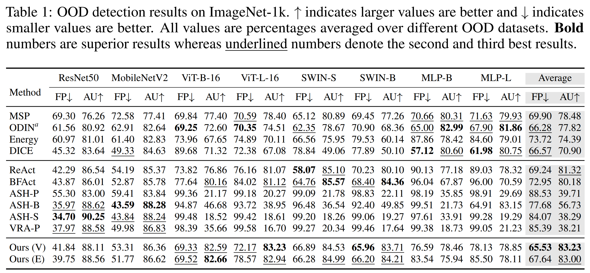

# Towards Optimal Feature-Shaping Methods for Out-of-Distribution Detection

This repository contains the source code for the paper presented at **ICLR 2024**

**Towards Optimal Feature-Shaping Methods for Out-of-Distribution Detection.** [[Paper](https://arxiv.org/abs/2402.00865)]

*Qinyu Zhao, Ming Xu, Kartik Gupta, Akshay Asthana, Liang Zheng, Stephen Gould*


## Abstract
Feature shaping refers to a family of methods that exhibit state-of-the-art performance for out-of-distribution (OOD) detection. These approaches manipulate the feature representation, typically from the penultimate layer of a pre-trained deep learning model, so as to better differentiate between in-distribution (ID) and OOD samples. However, existing feature-shaping methods usually employ rules manually designed for specific model architectures and OOD datasets, which consequently limit their generalization ability. To address this gap, we first formulate an abstract optimization framework for studying feature-shaping methods. We then propose a concrete reduction of the framework with a simple piecewise constant shaping function and show that existing feature-shaping methods approximate the optimal solution to the concrete optimization problem. Further, assuming that OOD data is inaccessible, we propose a formulation that yields a closed-form solution for the piecewise constant shaping function, utilizing solely the ID data. Through extensive experiments, we show that the feature-shaping function optimized by our method improves the generalization ability of OOD detection across a large variety of datasets and model architectures.


## Getting Started

### Installation
####  Clone this repository to your local machine.

```
git clone https://github.com/Qinyu-Allen-Zhao/OptFSOOD.git
```

### Usage

#### 1. Download the dataset
- Download [ImageNet-1k](http://www.image-net.org/challenges/LSVRC/2012/index) and place the training data and validation data in `<YOUR_DATA_PATH>/ImageNet_1k_2012/train` and `<YOUR_DATA_PATH>/ImageNet_1k_2012/val`, respectively. We note that the structure of validation set was changed. Please use `./utils/imagenet_folder_gen.py` to modify the validation set (you need to download the annotations for validation set as well).
- Download the datasets we used. We provide a zip file on [Google Drive](https://drive.google.com/file/d/1uEFR27O7WCtexYgXvy34pWqHdAm0rayW/view?usp=drive_link).
- Unzip the file and edit the root directory of all datasets in the `./config/datasets.yaml` file.

#### 2. Download the model checkpoints
- A zip file of model checkpoints is provided on [Google Drive](https://drive.google.com/file/d/17i5exxLSSoXxs219xtKbEDGI4a8kDIva/view?usp=drive_link). We download most checkpoints from torchvision and Hugging Face, and trained two MLP-Mixer models for CIFAR datasets.
- Please download and unzip the file under this directory.
- If you are using your own model checkpoints, please modify `cfg.resume` accordingly in `./config/experiments/`

#### 3. Evaluate different OOD methods

You can use the `eval_ood.py` file to evaluate different OOD methods on different benchmarks. We also provide a sample script in `./script/example_imagenet_rn50.sh` for reference.

    ```
    python eval_ood.py -h
    usage: Evaluate different OOD detection methods. [-h] [-b BATCH_SIZE] [-d DETECTOR]
                                                     [-e {imagenet,cifar10,cifar100}]
                                                     [-m {rn50,mb,vit_b,vit_l,swin_s,swin_b,mix_b,mix_l,dense,mix_n}]
                                                     [-s] [-p P] [-g] [-r] [-o {vanilla,energy}]
    
    options:
      -h, --help            show this help message and exit
      -b BATCH_SIZE, --batch_size BATCH_SIZE
                            Batch Size. It should have no influence on results but on the IO speed.
      -d DETECTOR, --detector DETECTOR
                            The OOD detection method.
      -e {imagenet,cifar10,cifar100}, --experiment {imagenet,cifar10,cifar100}
                            The benchmark name.
      -m {rn50,mb,vit_b,vit_l,swin_s,swin_b,mix_b,mix_l,dense,mix_n}, --model {rn50,mb,vit_b,vit_l,swin_s,swin_b,mix_b,mix_l,dense,mix_n}
                            The model for evaluation.
      -s, --use_surrogate   Use surrogate to estimate parameters in methods. See Appendix.B.
      -p P, --p P           Hyperparameters in prior methods. See Appendix.A.
      -g, --is_gaussian     Use Gaussian surrogate to estimate parameters in methods. See
                            Appendix.B.
      -r, --use_real        Use read OOD data to estimate parameters in methods. See Appendix.B.
      -o {vanilla,energy}, --use_ood_score {vanilla,energy}
                            The vanilla method denoted “Ours (V)”, based on the maximum logit
                            score, and there is a variant based on energy scores.
    ```


## OOD Detection Results

Our method achieves state-of-the-art performance averaged on the ImageNet benchmark across a variety of OOD datasets and methods.




## Citation

If you use our codebase or our results in your research, please cite our work:

```bibtex
@inproceedings{zhao2024towards,
    author = {Zhao, Qinyu and Xu, Ming and Gupta, Kartik and Asthana, Akshay and Zheng, Liang and Gould, Stephen},
    title = {Towards Optimal Feature-Shaping Methods for Out-of-Distribution Detection},
    booktitle = {ICLR},
    year = {2024}
}
```


## References

This codebase refers to the OpenOOD v1.0 benchmark. For further details, visit [OpenOOD GitHub Repository](https://github.com/Jingkang50/OpenOOD/tree/main).

```bibtex
# v1.0 report
@article{yang2022openood,
    author = {Yang, Jingkang and Wang, Pengyun and Zou, Dejian and Zhou, Zitang and Ding, Kunyuan and Peng, Wenxuan and Wang, Haoqi and Chen, Guangyao and Li, Bo and Sun, Yiyou and Du, Xuefeng and Zhou, Kaiyang and Zhang, Wayne and Hendrycks, Dan and Li, Yixuan and Liu, Ziwei},
    title = {OpenOOD: Benchmarking Generalized Out-of-Distribution Detection},
    year = {2022}
}
```


